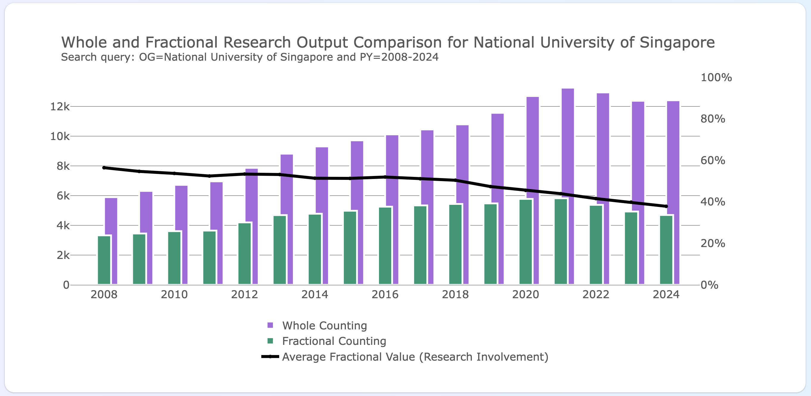
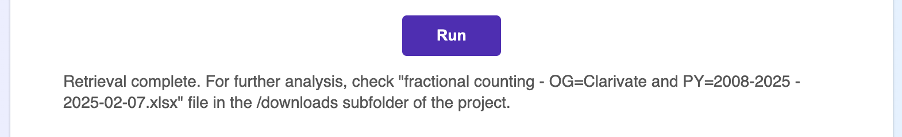
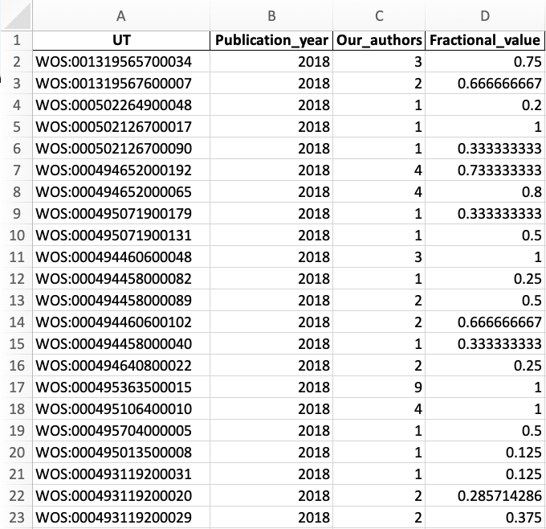
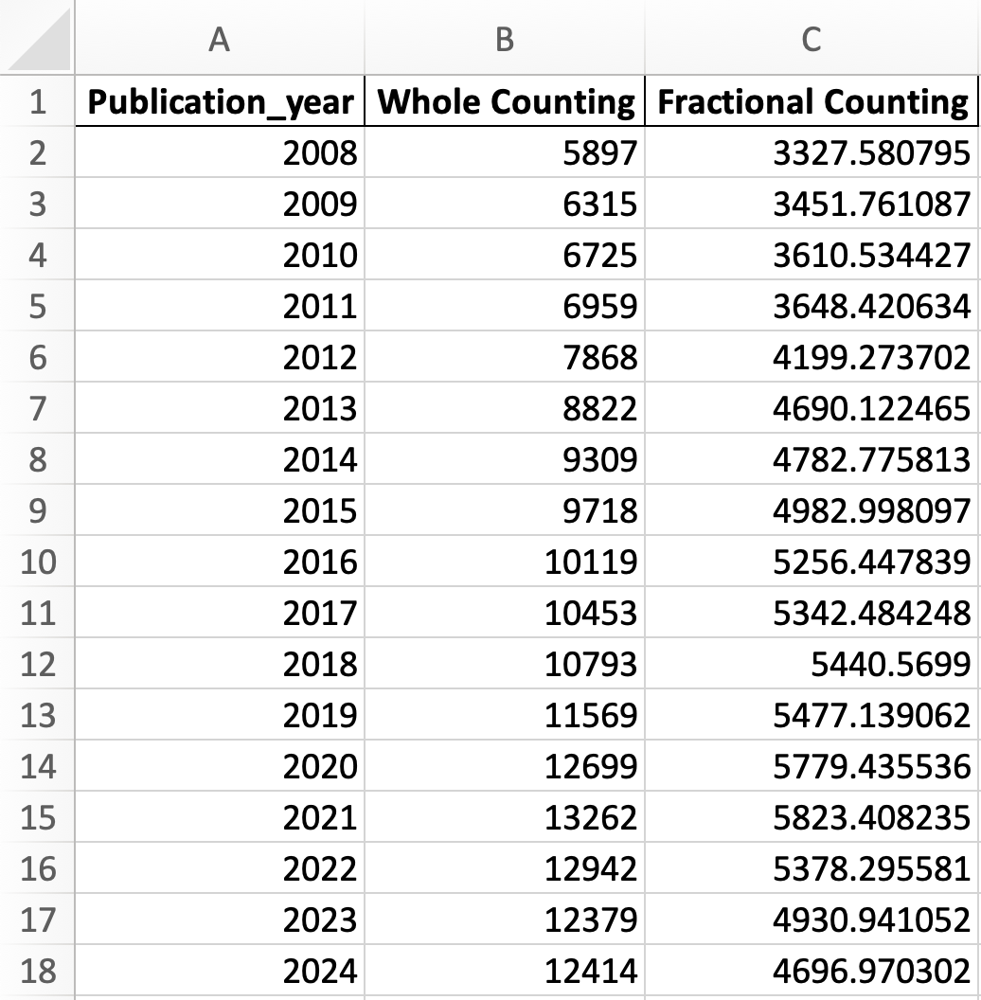

# Web of Science Expanded API Fractional Counting Calculator



## A Flask application with a simple graphical user interface to analyse and visualise organizational research output using fractional counting approach that retrieves data using Web of Science Expanded API.

The default way of counting papers and citations to them, being currently used in Web of Science, InCites, and other Clarivate resources, is called whole counting, or full counting method. In the case of full counting, a research output is fully attributed to each of the authors and/or each of the affiliated organizations. For example, a publication coauthored by two authors from two different universities counts as a full publication for each of the coauthors and each of the universities. In the fractional counting case, a research output is fractionally distributed between each coauthor and/or each organization. In a similar example, a publication coauthored by two authors from two different universities counts only as a half publication for each of the coauthors and each of the universities.

As already mentioned, the full counting method is the generally accepted one, but it can sometimes give unproportionally high scores to research made in extremely large collaborations, thus favoring the authors and organizations that participate in such projects. For more reading about multiauthorship and why this is important, please refer to Institute of Scientific Information's recent [Global Research Report – Multi-authorship and research analytics](https://clarivate.com/webofsciencegroup/campaigns/global-research-report-multi-authorship-and-research-analysis/).

There are several types of fractional counting: author-level, organization-level, etc. The choice of a fractional counting method often depends on the purpose of the study, for more information on various fractional counting methods and their advantages for certain research tasks please refer to the following paper:

[Ludo Waltman, Nees Jan van Eck, Field-normalized citation impact indicators and the choice of an appropriate counting method, Journal of Informetrics, Volume 9, Issue 4, 2015, Pages 872-894, ISSN 1751-1577, https://doi.org/10.1016/j.joi.2015.08.001.](https://www.sciencedirect.com/science/article/abs/pii/S1751157715300456)

For the purposes of this algorithm, we apply the author-level fractional counting method for the papers of an organization. The algorithm retrieves the publication data via Web of Science Expanded API and uses the organizational affiliation, or verified organization profile a.k.a. "Organization-Enhanced" field in Web of Science Core Collection, to count the fractional volume of research output for a given time period. This is how it works:

#### How to use it
Download the code, open the project folder where you saved it and create a python file `apikeys.py` right in the project folder. In that file, you need to create a constant representing your Web of Science Expanded API key and pass its string value as in the example below:

```
EXPANDED_APIKEY = 'mYw3b0f$c14nc33xp4nd3d4p1k3y1$4$3cr37'
```

You might also need to install the project dependencies, which are:
- Flask;
- Pandas (and openpyxl);
- Requests;
- Plotly.

And launch the app.py file. Flask will create a development server on http://127.0.0.1:5000 which you can open locally in any browser. This is what the start page looks like:


On the webpage, enter a Web of Science Core Collection Advanced Search query into the first field, and the affiliation which you'd like to analyze for its fractional output, into the "Affiliation" field.

For example, for an affiliation search on Clarivate for publication years of 2008 to 2025 (you can simply replace Clarivate with your organisation name):

Advanced Search Query Builder:
```
OG=Clarivate and PY=2008-2025
```

Affiliation:
```
Clarivate
```

Although this application is designed for running searches on affiliations, you can enter any search query into the Advanced Search Query Builder field, i.e. a topical search our a country search. However, the Affiliation field should always contain one name for the organization you're trying to analyze.

Then click the "Run" button. Please keep in mind that as Web of Science Expanded API has a limit of 100,000 records to be retrieved per search query, it is a good idea to validate your search if you're not sure how many records it's going to return.

The data retrieval should take some time. When the data extraction is complete, the program will refresh the page and add an interactive visualisation with Plotly. It will also save an Excel file with all the key metrics into the /downloads/ subfolder of the project folder. In this Excel spreadsheet, each Web of Science Core Collection document will be represented by its Accession Number (a unique record identifier in the Web of Science Core Collection), the number of coauthors of this paper from the organization being analyzed, and finally the fraction of an organization's input into this specific paper in the rightmost column. The program will also create a separate sheet in this file with the sum of the values for the fractional and full counting research output of this organization broken down by years.



You can use these Excel files for further analysis or reuse them right in the app by uploading the file into the bottom form.

These Excel tables will look like this:





Although this is a good step in automating the routine work of calculating the research output using fractional counting method, we would like to highlight a few limitations:

1. Author-level fractional counting relies on links between "author" and "organization" fields in the Web of Science Core Collection record metadata. As there was no generally accepted practice to have these links in every published paper before mid-2007, this method of fractional counting will not return reliable results for the Web of Science Core Collection records published before 2008.
2. The fractional counting value for a paper might sometimes show "0" if the paper is returned by Web of Science Core Collection Affiliation search but the record is not linked to the organization profile. If this is the case (the organization address in the metadata returned by the API will not have an `"organization": {"pref": "Y"}` field, and the same record in Web of Science user interface will not have a small triangle next to the organization address), the problem can be resolved by providing a "Suggest a correction" feedback right in the Web of Science interface.
3. The above can also happen even when the Web of Science record is linked to an organization profile, and the paper was published after the year 2007, but a single author name field which belongs to an author from your organization is not linked to your organization field, so there's no way we can confidently relate the author to the organization. Most likely this would mean that there has been an issue between the publisher submitting publication metadata into Web of Science Core Collection and indexing this data by us, and the link between the author name and the organization name in this record can also be restored by providing a "Suggest a correction" feedback right in the Web of Science interface.
4. Organizational affiliation can sometimes be missing in the "regular" Address list but appear in Reprint, or Corresponding, address list of certain papers. Although this is quite a rear event, it is technically possible to add a function for counting the corresponding addresses, but at the moment there is no consensus on how the presence and the amount of reprint addresses should affect the denominator of the fractional counting formula.
5. We do not encourage using this code right away for preparing the official research output reporting in the countries where the local regulators request such reports. Before submitting the external report based on this algorithm, we suggest double checking the numbers, and welcome any feedback to further improve this algorithm.

This application was created to demonstrate the capabilities of Web of Science APIs and custom XML data, and is not a commercial product of Clarivate. It will be reviewed and updated in the future but it will not have the same regular update frequency we normally offer for our commercial products. We do not recommend using this application as a ready-made solution for reporting purposes or for supporting important grant funding decisions. We however encourage the bibliometric community provide feedback on improving this script and to use the script as a base for more advanced analytical projects.

For a consistent experience, intuitive user interface and world-class customer support, please refer to our products like Web of Science, InCites Benchmarking & Analytics, and Journal Citation Reports.
