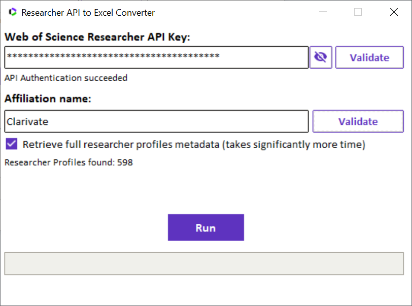
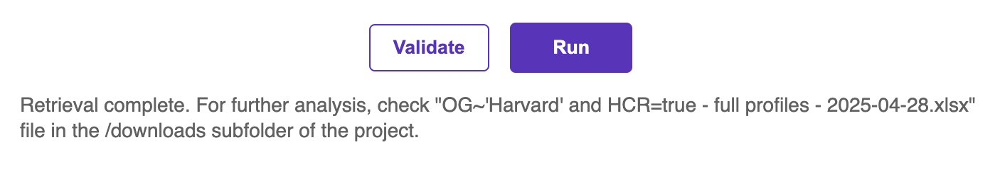

# Researcher API to Excel converter

## A program with a simple GUI that extracts the researchers data from an organisational search using Researcher API, and organises it into an Excel table

This is a very simple program that requires a [Researcher API key](https://developer.clarivate.com/apis/wos-researcher), and an Affiliation name. It's running a search on every researcher profile that is affiliated with that organization, returns the researcher metadata, and saves it in an .xlsx file in the project folder

#### The user needs to launch the main.py file and enter:
1. Their Researcher API key;
2. The name of the Affiliaiton for which they would like to retrieve the researchers data
3. Click the checkbutton if they want the program to query each researcher profile individually and receive full researcher profiles metadata (including research output numbers broken down by publication years, first/last/corresponding author statistics, published names, alternative affiliations, etc.) or if they are ok with receiving basic profiles metadata which is going to be much quicker

And click the Run button.

The program will create an Excel file in the same project folder, where, if the "Retrieve full researcher profiles metadata" tickbox hasn't been ticked, each Researcher record will have their:
- ResearcherID,
- full name,
- their primary affiliation,
- H-index,
- Number of documents found,
- Times cited counts,
- as well as a link to their researcher profile on Web of Science platform user interface, resolved through the ResearcherID.

If the "Retrieve full researcher profiles metadata" tickbox has been ticked, then additional data fields, such as Published Names, research output by years, times cited without self-citations, and more, will also be retrieved and stored in the excel file, some of them on separate sheets.

It is also possible to develop a functionality to retrieve the basic document-level and peer reviews data, as the relevant links to the correct endpoints are also returned by a get-request to the default /researchers endpoint, but each of these requests will take additional time. These two additional tickboxes will appear in subsequent releases of this converter tool.

As always, we welcome user feedback on this code.
