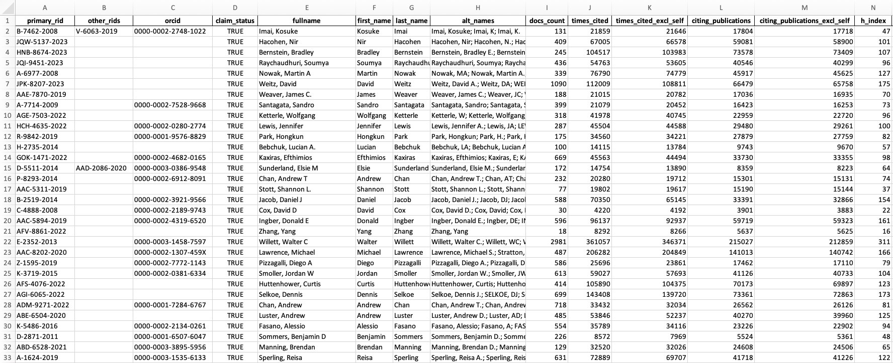
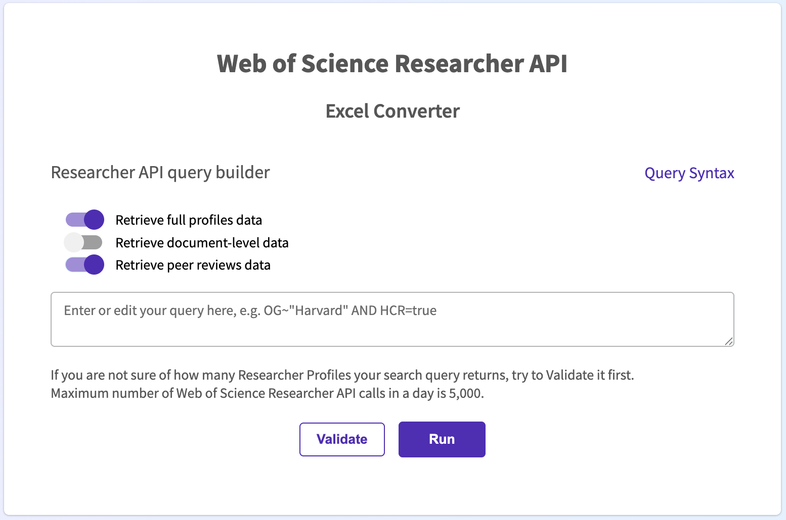

# Researcher API to Excel converter




## A minimalistic Flask application that extracts the researchers data using Researcher API, and organises it into an Excel table

This is a very simple application that requires a [Researcher API key](https://developer.clarivate.com/apis/wos-researcher) to work. It's running a search using [Researcher API search syntax](https://api.clarivate.com/swagger-ui/?url=https%3A%2F%2Fdeveloper.clarivate.com%2Fapis%2Fwos-researcher%2Fswagger), returns the researcher metadata, and saves it in an .xlsx file in the /downloads subfolder of the project.


### How to use it
Download the code, open the project folder where you saved it and create a python file `apikeys.py` right in the project folder. There, you need to create a constant representing your Web of Science Researcher API key and pass its value as a string like in the example below:

```
RESEARCHER_APIKEY = 'mYw3b0f$c14nc3r3534rch3r4p1k3y1$4$3cr37'
```

You might also need to install the project dependencies, which are:
- Flask;
- Pandas (and openpyxl);
- Requests.

And launch the app.py file. Flask will create a development server on http://127.0.0.1:5000 which you can open locally in any browser. This is what the start page looks like:



Then, enter the search query (important: the Researcher API search syntax is different from that of Web of Science Advanced Search Queries, please refer to the [Researcher API swagger](https://api.clarivate.com/swagger-ui/?url=https%3A%2F%2Fdeveloper.clarivate.com%2Fapis%2Fwos-researcher%2Fswagger) for the correct search syntax). You may use the "Retrieve full profiles" toggle to retrieve:
- either only the high-level profile metadata for each researcher, such as their IDs, name, and key metrics,
- or their full profile metadata, also including their published names, past affiliations, author position and Highly Cited Researcher status.

Please note that the first option takes significantly less API calls and, therefore, time, to complete. As there is a daily limit on the number of Researcher API calls that you may use, we encourage you to also use the "Validate" button to check if your search query can be completed in full.

After you hit the "Run" button, the app will query Web of Science Researcher API, extract the researcher profiles and save the metadata into an Excel file in the /downloads subfolder of the project folder


As always, we welcome user feedback on this code.
