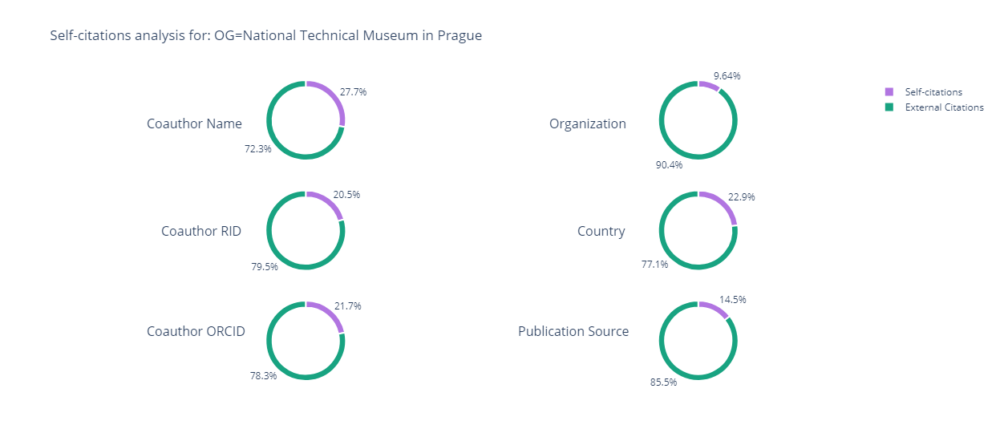

# Various types of Self-citation



## A universal script to evaluate the self-citation percentage for a set of Web of Science documents at any level of user's preference. The script relies on retrieving the publication data via Web of Science Expanded API.


This script allows to evaluate the following types of self-citation to a given Web of Science document or a set of documents:
1. Coauthor-level self-citation (when there are the same author records appearing in both cited and citing paper)
2. Organization-level self-citation (when the authors in cited and citing papers might be different, but represent the same organization)
3. Country-level self citation (when the authors and organisations in cited and citing papers might be different, but all come from the same country)
4. Journal self-citation (when the authors and/or organization in cited and citing papers might be different, but both records were published in the same title)

This is how it works:

#### In the code of the program, the user needs to enter:
1. Their Web of Science Expanded API key;
2. In the line 22, pass the string containing the Web of Science Core Collection advanced search query for a set of records they would like to analyse, for example:

```
# Enter the WoS search query to evaluate its self-citation percentage:
SEARCH_QUERY = 'AI=A-5224-2009'
```

And launch the code.

The program will query Web of Science Expanded API, retrieve the necessary document metadata, and apply sets.intersection() method to each of them to check if self-citation occured at any of the described levels, and for every case where a self-citation even would occur, the program will additionally query Web of Science Expanded API for the cited references of the citing paper to check the number of cited reference in it that lead to the cited document. The result is then printed in the IDE Run window / terminal / command prompt (depending on where you launched the program from), visualised using Plotly package, and saved into a .csv file in the same project folder.

The total self-citation is calculated as follows:

Self-citation of a set of documents = (number of self-citations of this type found in the citing documents) / (total times cited count for that set of cited papers)

Although this is a good step towards increasing the precision of self-citation calculation, we would like to address a few limitations of this approach:

1. As the author name in Web of Science Core Collection might require additional disambiguation, coauthor-level self-citation analysis provides additional check for:
- documents linked to ResearcherID profiles of the authors
- documents linked to ORCID profiles of the authors
But we would like to stress that neither of those approaches can guarantee 100% precision of author disambiguation at the moment.
2. It is important that the coauthor-level analysis mentioned above works exactly what it is named for: coauthor-level self-citations, and we suggest that the users understand the differentce between coauthor self-citation and author self-citation which are not the same phenomenons in bibliometrics. Author self-citation identifies a self-citation event only if the specific author being analyzed appears on both cited and citing paper. On contrast, coauthor self-citation identifies a self-citation event even if the author being analyzed didn't cite their own research, but it's their coauthors who did. While it is techincally possible to include only the author-level self-citation into this algorithm, we decided that including too many inputs as well as output metrics might actually make it harder to measure self-citations wiht this program, so we decided to use the same coauthor-level self-citation approach used in the following two scholarly papers which we consider very important to understanding the self-citation methodology:

[Dag W. Aksnes,
A macro study of self-citation,
Scientometrics,
Volume 56, No. 2,
2003,
Pages 235-246,
https://doi.org/10.1023/A:1021919228368.](https://link.springer.com/article/10.1023%2FA%3A1021919228368)

[Wolfgang Glänzel, Bart Thus
Doesco-authorshipinflatetheshareofself-citations?,
Scientometrics,
Volume 61, No. 3,
2004,
Pages 395-404,
https://doi.org/10.1023/B:SCIE.0000045117.13348.b1.](https://link.springer.com/article/10.1023%2FB%3ASCIE.0000045117.13348.b1)

For assesing the volumes of author-only self-citations, please refer to a simpler [H-index without self-citations code available here](https://github.com/clarivate/wos_api_usecases/tree/main/researcherid-based_h-index_excluding_self-citations/).

3. Self-citation might appear the most obvious way of citation manipulation. However, excessive self-citation rate for a given paper does not necessarily indicate that a citation manipulation has occured, simliarly self-citation rate of acceptable percentage (normally below 20-30%) doesn't guarantee that there hasn't been any scientific misconduct. In order to explore the potential citation manipulations with more reliability, it is advised to run a check for high concentration of citations to a paper coming from specific author or group of authors, publication sources, organizations, etc.
