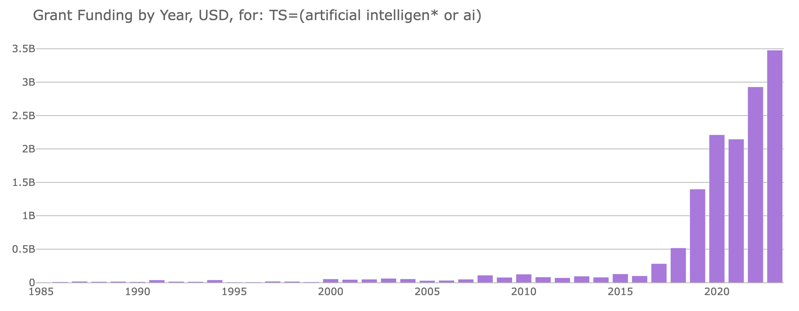
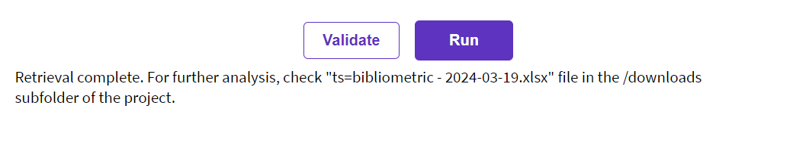
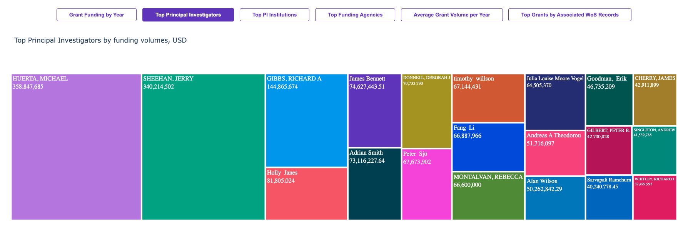
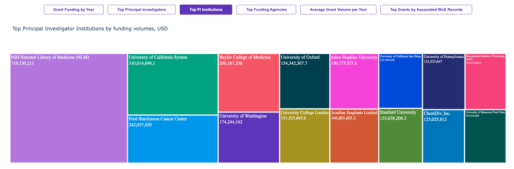
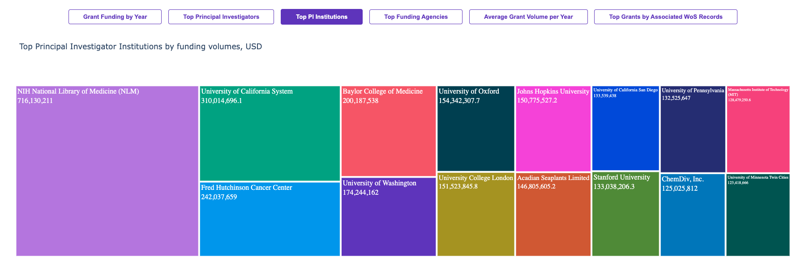
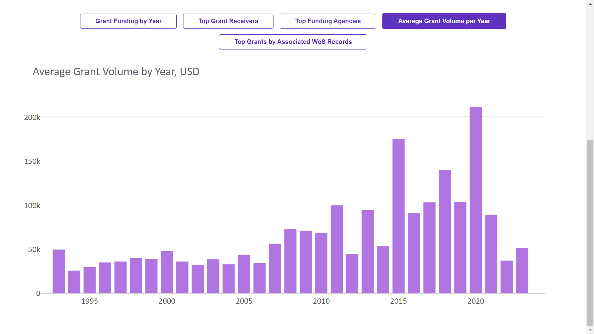

# Web of Science Grants Index Analytics via Web of Science Expanded API



## A Flask application with a simple graphical user interface to analyse and visualise the grant data from Web of Science Grants Index. The application retrieves the grant data via Web of Science Expanded API

This application retrieves grants records from Web of Science Grants Index for any Advanced Search query via Web of Science Expanded API, visualises it in a variety of ways with Plotly package, and saves them records metadata into an Excel spreadsheet.

The application uses [Open Exchange Rates API](https://open.er-api.com) for converting grant values into US dollars in order for the app to be able to produce trend graphs in a common currency.

#### How to use it
Download the code, open the project folder where you saved it and create a python file named `apikeys.py`. There, create a constant representing your Web of Science Expanded API key and pass its value as a string like in the example below:

```
EXPANDED_APIKEY = 'mYw3b0f$c14nc33xp4nd3d4p1k3y1$4$3cr37'
```

You might also need to install the project dependencies, which are:
- Flask;
- Pandas (and openpyxl);
- Requests;
- Plotly.

And launch the app.py file. Flask will create a development server on http://127.0.0.1:5000 which you can open locally in any browser. This is what the start page looks like:


On the webpage, you can enter a Web of Science Grants Index Advanced Search query, i.e., for a topical search on bibliometrics:

```
TS=bibliometrics*
```

And press the "Run" button. Please note that as Web of Science Expanded API has a limit of 100,000 records to be retrieved per search query, it is a good idea to validate your search if you're not sure how many records it's going to return.

When the data extraction is complete, the program will refresh the page and add the interactive visualisation plots with Plotly which you can switch between. It will also save an Excel file with all the metadata retrieved into a /downloads/ subfolder of the project folder.



You can also use the Load a Previously Saved Excel File form to visualise previously saved files.

These are some of the examples of the visualisations:










This application was created to demonstrate the capabilities of Web of Science APIs and custom XML data, and is not a commercial product of Clarivate. It will be reviewed and updated in the future but it will not have the same regular update frequency we normally offer for our commercial products. We do not recommend using this application as a ready-made solution as it is for reporting purposes or for supporting important grant funding decisions. We however encourage the bibliometric community provide feedback on improving this script and to use the script as a base for more advanced analytical projects.

For a consistent experience, intuitive user interface and world-class customer support, please refer to our products like Web of Science, InCites Benchmarking & Analytics, and Journal Citation Reports.
