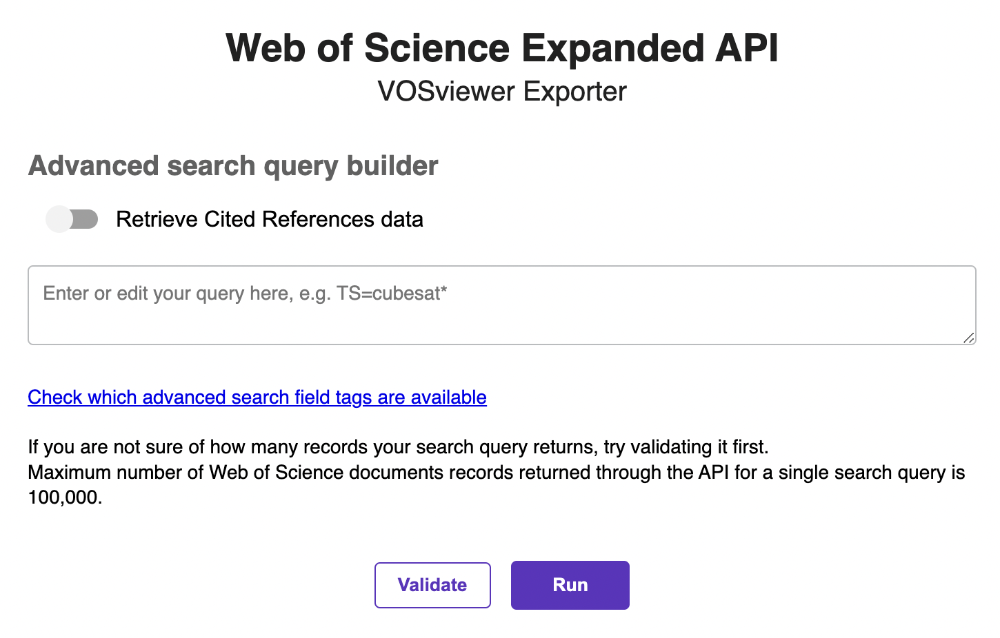

# Web of Science to VOSviewer exporter




## A Flask application for exporting the necessary metadata via Web of Science Expanded API to use it in the VOSviewer

#### How to use it:

All you need to do after you download this code is:

1. In the project folder, create an apikeys.py file, create a constant EXPANDED_APIKEY there and pass your Expanded API Key to it as a string value, like in the example below:

```
EXPANDED_APIKEY = 'mY3xp4nd3d4p1k3y1$$0m37h1Ngl1k37h15'
```

2. Launch the app.py file. It's going to run a development server, normally at the following address which you can click on in your Python terminal or just enter manually in your web browser: http://127.0.0.1:5000.
3. Enter the search query that defines the dataset you'd like to export into VOSviewer for further analysis.
4. Click "Run".

The program will retrieve all the necessary documents from the Web of Science via the Web of Science Expanded API, extract the metadata fields required for analysis in VOSviewer, and save them into a tab-delimited file in the /documents subfolder of the project. These files can then be easily uploaded into VOSviewer application.


This app isn't going to significantly reduce the time it takes to export the Web of Science data, but it will definitely allow you to enter the search query that you would like to analyse on the VOSviewer, hit the "run" button, and forget about the exporting process until it's finished.

You also have an option of extracting the cited references along with the documents. The cited reference data is required to perform the citation, bibliographic coupling, and co-citation analyses, but it takes significantly longer time for all the cited references to be retrieved. If you'd only like to run a co-authorship or keyword co-occurrence analysis on VOSviewer, we recommend that you leave this option unchecked.

#### Using this app with Web of Science Starter API

This code, unlike [a similar tkinter-based converter](/./python/wos_to_vosviewer_exporter_tkinter/) is not compatible with Web of Science Starter API. However, it is possible to adapt this code to run with Web of Science Starter API, but please keep in mind that Web of Science Starter API is not designed to return a number of metadata fields that are important for analysis on VOSviewer.  

As always, we welcome your feedback on this code.